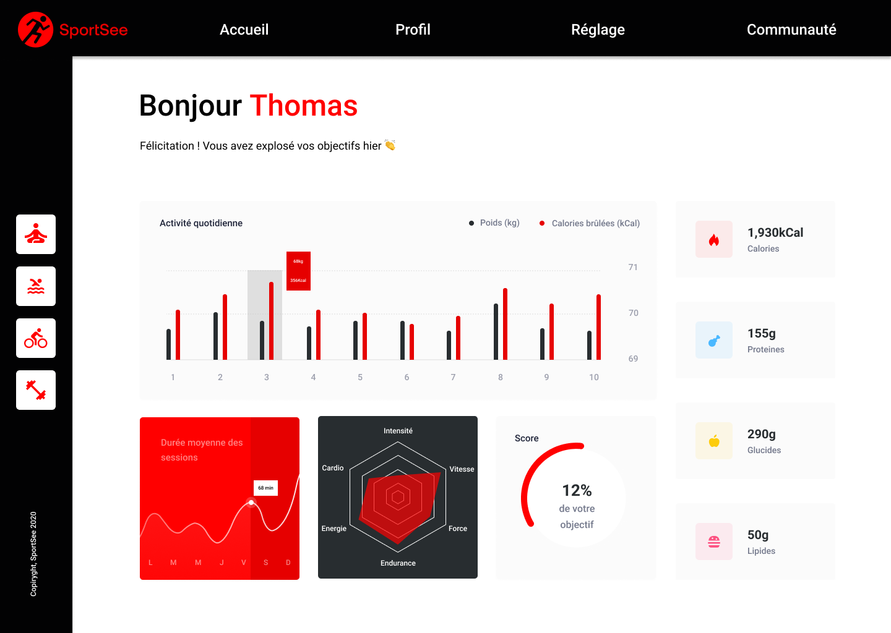

# 

### Description

This project is a simple dashboard that dislays charts using D3.js from data fetched from a REST API. It is a simple project to learn D3.js and how to use with React.

### Installation

1. Clone this repository
2. Install dependencies : `pnpm install`
3. Run the project : `vite` or `pnpm dev`

### Technologies used

| Name         | Version |
| ------------ | ------- |
| React        | 18.3+   |
| React Router | 6.2+    |
| Vite         | 5.2+    |
| Node.js      | 20+     |
| D3.js        | 7.9+    |
| Tailwind CSS | 3.4+    |
